Jenkins安装部署

> https://jenkins.io/zh/doc/book/installing/

##### 环境：

- 系统：CentOS7.5
  - jenkins 192.168.1.201
  - tomcat  192.168.1.51
- Java：1.8.0-212
- jenkins： 2.176.2-1.1
- Tomcat：8.5.43

##### 1、安装java 、tomcat

```shell
# 两台主机都安装java
[root@lab ~]# yum install -y java
[root@lab ~]# java -version
openjdk version "1.8.0_212"
OpenJDK Runtime Environment (build 1.8.0_212-b04)
OpenJDK 64-Bit Server VM (build 25.212-b04, mixed mode)

# tomcat所在主机
[root@anatronics app]# pwd
/app
[root@anatronics app]# wget http://mirrors.tuna.tsinghua.edu.cn/apache/tomcat/tomcat-8/v8.5.43/bin/apache-tomcat-8.5.43.tar.gz
[root@anatronics app]# tar xf apache-tomcat-8.5.43.tar.gz
[root@anatronics app]# ln -s apache-tomcat-8.5.43/ tomcat/

# 配置tomcat manger page
[root@anatronics app]# cd tomcat/    
[root@anatronics tomcat]# vim conf/tomcat-users.xml 
<role rolename="manager-gui"/>
<role rolename="admin"/>
<role rolename="manager"/>
<role rolename="manager-script"/>
<user username="jenkins" password="jenkins" roles="manager-gui,admin,manager,manager-script"/>
[root@anatronics tomcat]# vim webapps/manager/META-INF/context.xml 
  <Valve className="org.apache.catalina.valves.RemoteAddrValve"
         allow="^.*$" />
```

##### 2、获取jenkins包,并安装

```shell
[root@lab ~]# wget https://pkg.jenkins.io/redhat-stable/jenkins-2.176.2-1.1.noarch.rpm
[root@lab ~]# yum install ./jenkins-2.176.2-1.1.noarch.rpm
[root@lab ~]# rpm -ql jenkins
/etc/init.d/jenkins
/etc/logrotate.d/jenkins
/etc/sysconfig/jenkins
/usr/lib/jenkins
/usr/lib/jenkins/jenkins.war
/usr/sbin/rcjenkins
/var/cache/jenkins
/var/lib/jenkins
/var/log/jenkins
```
##### 3、启动服务

```shell
[root@lab ~]# systemctl start jenkins
[root@lab ~]# ss -tlnp|grep java
LISTEN     0      50          :::8080                    :::*                   users:(("java",pid=18520,fd=166))
```

##### 4、初始化操作

浏览器访问192.168.1.201:8080

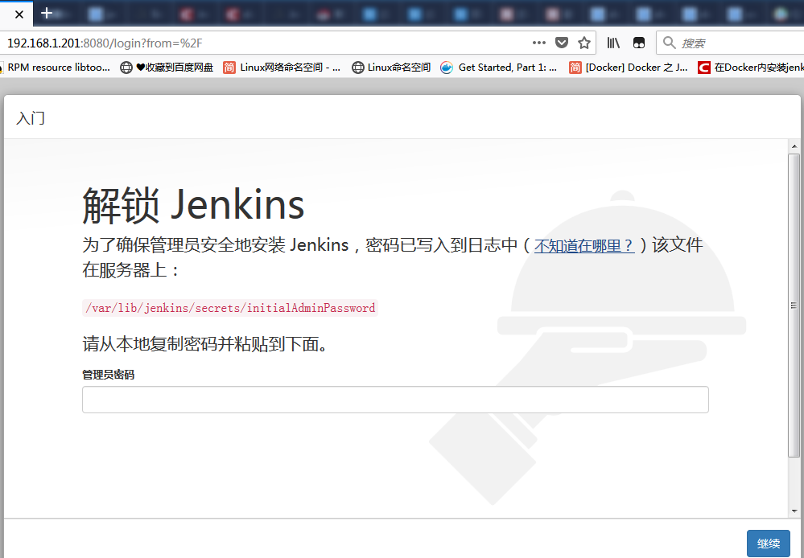

根据提示查看密码：

```shell
[root@lab ~]# cat /var/lib/jenkins/secrets/initialAdminPassword
658a430f0dea4c15860abc04c9365b8c
```

输入密码，安装插件，之后设置管理员用户

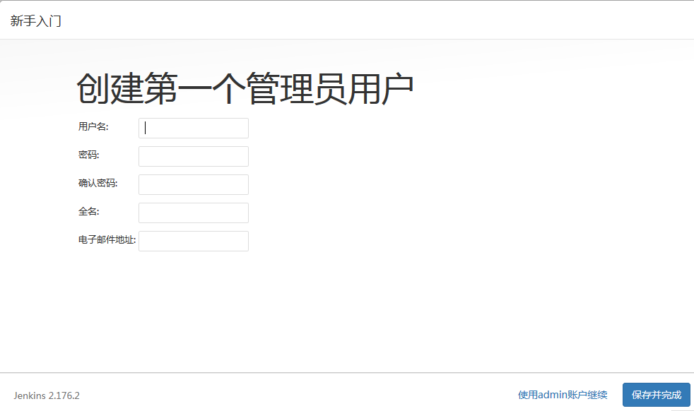

进入页面

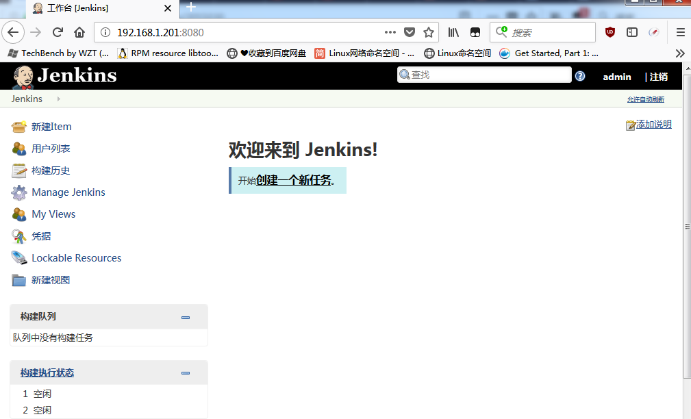

Deploy to container Plugin

Publish Over SSH

##### 5、部署一个maven demo

安装deploy to contaner插件

1、新建一个maven项目

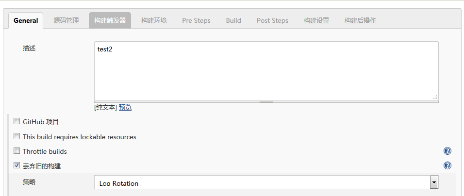

2、选择源码来源git

> https://github.com/bingyue/easy-springmvc-maven

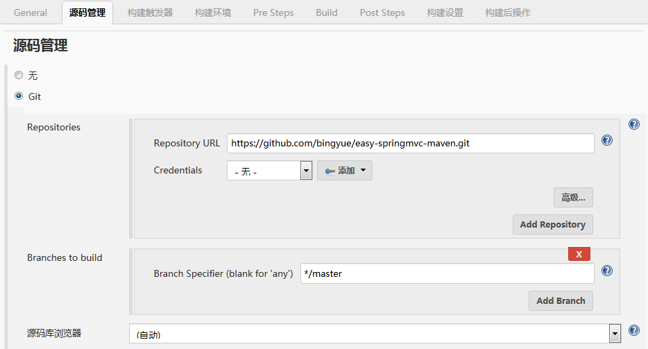

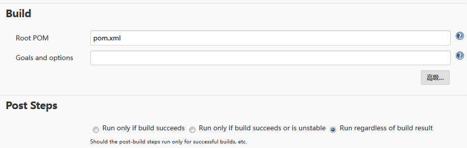

3、构建后操作

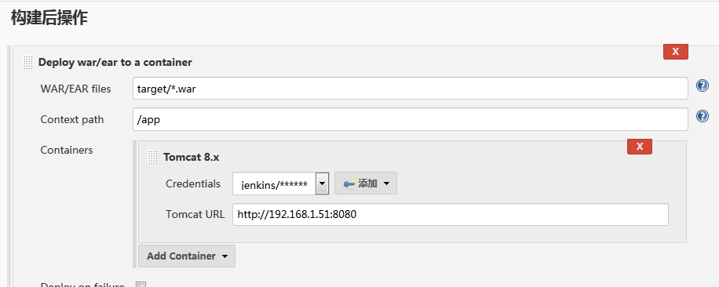


4、选择立即构建，查看控制台信息

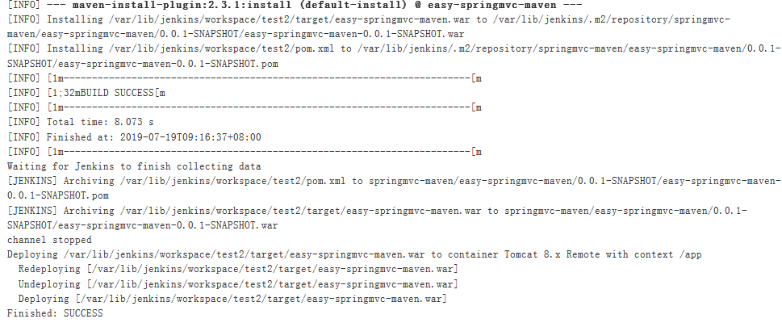

5、验证，在tomcat所在主机

查看tomcat目录

```shell
[root@anatronics webapps]# pwd
/app/tomcat/webapps
[root@anatronics webapps]# ls
app  app.war  docs  examples  host-manager  manager  ROOT
```

浏览器访问http://192.168.1.51:8080/app

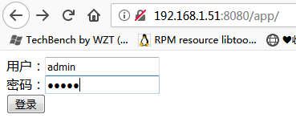

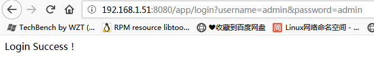

<<<<<<< HEAD
=======
**根据git的tag拉取源码**

1、安装git parameter插件

2、新建项目，选择参数化构建过程

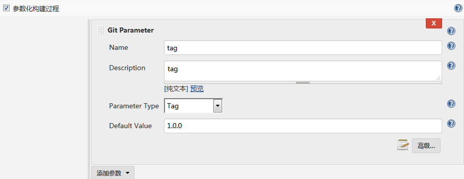

3、准备github源码的tag,并推送上去

```shell
[root@anatronics]# git clone https://github.com/weijuwei/easy-springmvc-maven.git

# 第一次更改提交，打上tag，并push
[root@anatronics easy-springmvc-maven]# git add .
[root@anatronics easy-springmvc-maven]# git commit -m "update user pass"
[root@anatronics easy-springmvc-maven]# git tag -a "1.0.0"
[root@anatronics easy-springmvc-maven]# git push origin master
[root@anatronics easy-springmvc-maven]# git push --tags 

# 第二次更改提交，打上tag，并push
[root@anatronics easy-springmvc-maven]# git add .
[root@anatronics easy-springmvc-maven]# git commit -m "update user pass"
[root@anatronics easy-springmvc-maven]# git tag -a "1.0.1"
[root@anatronics easy-springmvc-maven]# git push origin master
[root@anatronics easy-springmvc-maven]# git push --tags 

# 查看tag
[root@anatronics easy-springmvc-maven]# git tag
1.0.0
1.0.1
```

4、选择Bulid with Parameters

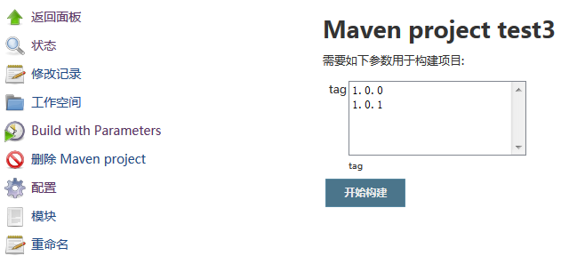
>>>>>>> 566881d6ce561b13e4ea50f3068f213a5624089d
