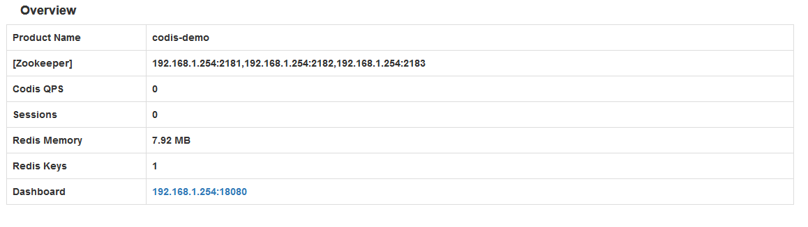
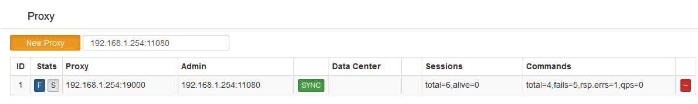
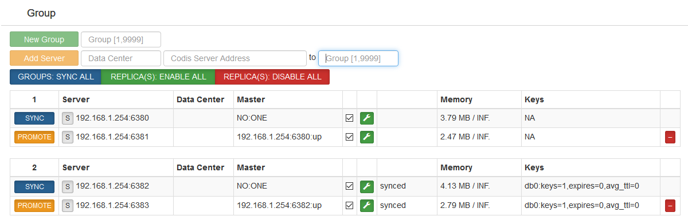
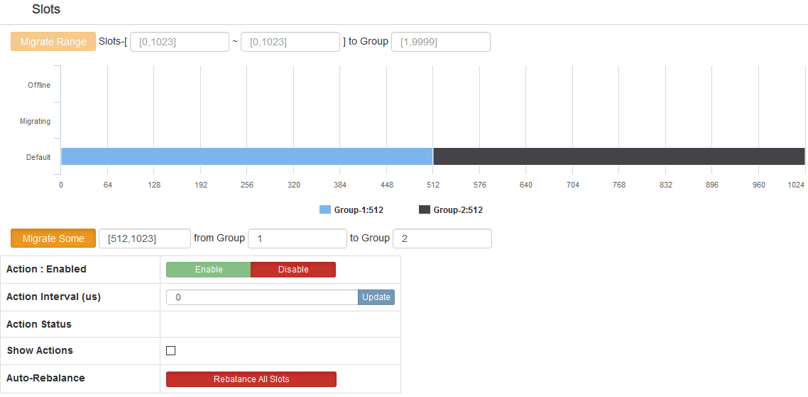

> https://github.com/CodisLabs/codis/blob/release3.2/doc/tutorial_zh.md

### 系统环境
zookeeper集群
* zookeeper 192.168.1.254:2181
* zookeeper 192.168.1.254:2182
* zookeeper 192.168.1.254:2183

codis 3.2.2

codis-server

* 192.168.1.254:6380
* 192.168.1.254:6381
* 192.168.1.254:6382
* 192.168.1.254:6383


### 安装
#### 安装Go运行环境
```shell
# https://golang.google.cn/dl/ 获取go相关
[root@anatronics src]# wget https://dl.google.com/go/go1.8.5.linux-amd64.tar.gz
[root@anatronics src]# tar xf go1.8.5.linux-amd64.tar.gz 
[root@anatronics src]# mv go /usr/local/
[root@anatronics local]# mkdir /usr/local/go/work

[root@anatronics local]# vim /etc/profile.d/go.sh
export PATH=$PATH:/usr/local/go/bin
export GOROOT=/usr/local/go
export GOPATH=/usr/local/go/work

[root@anatronics local]# source /etc/profile.d/go.sh 

[root@anatronics local]# go version
go version go1.8.5 linux/amd64

[root@anatronics codis]# go env GOPATH
/usr/local/go/work
```
#### zookeeper部署
> https://github.com/weijuwei/note/blob/master/zookeeper.md

#### 安装部署codis
##### 1、安装
###### 二进制包安装
```shell
# 获取二进制包和源码包
[root@anatronics src]# wget https://github.com/CodisLabs/codis/releases/download/3.2.2/codis3.2.2-go1.8.5-linux.tar.gz

[root@anatronics src]# tar xf codis3.2.2-go1.8.5-linux.tar.gz 
[root@anatronics src]# mv codis3.2.2-go1.8.5-linux /apps/
[root@anatronics apps]# ln -sv /apps/codis3.2.2-go1.8.5-linux/ /apps/codis
```
###### 源码编译
```shell
# 建立相关目录
[root@anatronics codis]# mkdir -p $GOPATH/src/github.com/CodisLabs

# 获取源码包
[root@anatronics src]# wget https://github.com/CodisLabs/codis/archive/3.2.2.tar.gz

# 解压源码包到$GOPATH/src/github.com/CodisLabs下
[root@anatronics CodisLabs]# pwd
/usr/local/go/work/src/github.com/CodisLabs
[root@anatronics CodisLabs]# ls
codis  codis-3.2.2

# 编译安装
[root@anatronics codis]# pwd
/usr/local/go/work/src/github.com/CodisLabs/codis
[root@anatronics codis]# make
make -j -C extern/redis-3.2.8/
... ...
go build -i -o bin/codis-dashboard ./cmd/dashboard
go build -i -o bin/codis-proxy ./cmd/proxy
go build -i -o bin/codis-admin ./cmd/admin
go build -i -o bin/codis-fe ./cmd/fe
...

# 运行程序
[root@anatronics bin]# pwd
/usr/local/go/work/src/github.com/CodisLabs/codis/bin
[root@anatronics bin]# ls
assets       codis-dashboard  codis-ha     codis-server     redis-cli       version
codis-admin  codis-fe         codis-proxy  redis-benchmark  redis-sentinel
[root@anatronics bin]# 

# 一些脚本
[root@anatronics admin]# pwd
/usr/local/go/work/src/github.com/CodisLabs/codis/admin
[root@anatronics admin]# ls
codis-dashboard-admin.sh  codis-proxy-admin.sh
codis-fe-admin.sh         codis-server-admin.sh

# 相关配置文件
[root@anatronics config]# pwd
/usr/local/go/work/src/github.com/CodisLabs/codis/config
[root@anatronics config]# ls
dashboard.toml  proxy.toml  redis.conf  sentinel.conf
```

##### 2、相关目录
```shell
# 将源码包中的config目录拷贝到/apps/codis/目录下
[root@anatronics src]# tar xf 3.2.2.tar.gz 
[root@anatronics codis-3.2.2]# cp -r /apps/src/codis-3.2.2/config /apps/codis/

# /apps/codis目录下的文件
[root@anatronics codis]# pwd
/apps/codis
[root@anatronics codis]# ls
assets       codis-dashboard  codis-ha     codis-server  redis-benchmark  redis-sentinel
codis-admin  codis-fe         codis-proxy  config        redis-cli        version

# 建立相关目录
[root@anatronics codis]# mkdir /var/lib/codis
[root@anatronics codis]# mkdir /var/log/codis/
[root@anatronics codis]# mkdir /data/codis/
```
##### 3、配置文件
###### 1、codis-server配置文件
```shell
[root@anatronics config]# pwd
/apps/codis/config

[root@anatronics config]# grep "^[a-z]" redis.conf 
bind 192.168.1.254
port 6379
daemonize yes
pidfile /run/redis_6379.pid
logfile "/var/log/codis/redis_6379.log"
databases 16
dbfilename dump_6379.rdb
dir /data/codis/codis_6379

[root@anatronics config]# cp redis.conf redis_6380.conf
[root@anatronics config]# cp redis.conf redis_6381.conf
[root@anatronics config]# cp redis.conf redis_6382.conf
[root@anatronics config]# cp redis.conf redis_6383.conf

[root@anatronics config]# sed -i 's/6379/6380/g' redis_6380.conf 
[root@anatronics config]# sed -i 's/6379/6381/g' redis_6381.conf 
[root@anatronics config]# sed -i 's/6379/6382/g' redis_6382.conf 
[root@anatronics config]# sed -i 's/6379/6383/g' redis_6383.conf 
[root@anatronics config]# mkdir /data/codis/codis_638{0..3}

# 无法生成rd文件警告解决
#WARNING overcommit_memory is set to 0! Background save may fail under low memory condition. To fix this issue add 'vm.overcommit_memory = 1' to /etc/sysctl.conf and then reboot or run the command 'sysctl vm.overcommit_memory=1' for this to take effect.
```
###### 2、codis_proxy配置
```shell
[root@anatronics config]# vim proxy.toml
[root@anatronics config]# grep '^[a-z]' proxy.toml
product_name = "codis-demo"
product_auth = ""
session_auth = ""
admin_addr = "0.0.0.0:11080"
proto_type = "tcp4"
proxy_addr = "0.0.0.0:19000"
jodis_name = "zookeeper"
jodis_addr = "192.168.1.254:2181,192.168.1.254:2182,192.168.1.254:2183"
jodis_auth = ""
```
###### 3、codis dashboard配置文件
```shell
[root@anatronics config]# grep '^[a-z]' dashboard.toml
coordinator_name = "zookeeper"
coordinator_addr = "192.168.1.254:2181,192.168.1.254:2182,192.168.1.254:2183"
coordinator_auth = ""
product_name = "codis-demo"
product_auth = ""
admin_addr = "0.0.0.0:18080"
```
###### 4、codis-fe配置文件
```shell
[root@anatronics codis]# pwd
/apps/codis
[root@anatronics codis]# ./codis-admin --dashboard-list --zookeeper=192.168.1.254:2181 | tee config/fe.json
[
    {
        "name": "codis-demo",
        "dashboard": "192.168.1.254:18080"
    }
]
```
##### 4、启动相关
```shell
[root@anatronics codis]# pwd
/apps/codis

# 启动codis-server
[root@anatronics codis]# ./codis-server config/redis_6380.conf
[root@anatronics codis]# ./codis-server config/redis_6381.conf
[root@anatronics codis]# ./codis-server config/redis_6382.conf
[root@anatronics codis]# ./codis-server config/redis_6383.conf

# 启动codis-proxy 后台启动
[root@anatronics codis]# nohup /apps/codis/codis-proxy --config=/apps/codis/config/proxy.toml --log=/var/log/codis/proxy.log --log-level=INFO  --pidfile=/var/run/codis_proxy.pid > /var/log/codis/codis_proxy_daemon.log 2>&1 &

# 启动codis-dashboard 后台启动
[root@anatronics codis]# nohup /apps/codis/codis-dashboard --config=/apps/codis/config/dashboard.toml --log=/var/log/codis/dashboard.log --log-level=INFO --pidfile=/var/run/codis_dashboard.pid  > /var/log/codis/codis_dashboard_daemon.log 2>&1 &

# 启动codis-fe 后台启动
[root@anatronics codis]# nohup /apps/codis/codis-fe -d /apps/codis/config/fe.json -l /var/log/codis/fe.log --log-leve=INFO --listen=0.0.0.0:18090 --pidfile=/var/run/codis_fe.pid > /var/log/codis/codis_fe_daemon.log 2>&1 &
```
#### 测试
浏览器可访问进行操作 http://192.168.1.254:18090



1、新建Proxy



2、新建Group，将codis-server加入到指定group


3、划分slots



4、客户端连接proxy

```shell
[root@lab ~]# redis-cli -h 192.168.1.254 -p 19000
192.168.1.254:19000> set hello world
OK
192.168.1.254:19000> get hello
"world"

# 连接codis-server查看数据分配情况，数据被分配到group2上，并且数据已被复制
[root@lab ~]# redis-cli -h 192.168.1.254 -p 6380
192.168.1.254:6380> get hello
(nil)
192.168.1.254:6380> exit
[root@lab ~]# redis-cli -h 192.168.1.254 -p 6382
192.168.1.254:6382> get hello
"world"
192.168.1.254:6382>
[root@lab ~]# redis-cli -h 192.168.1.254 -p 6383
192.168.1.254:6383> get hello
"world"
```

