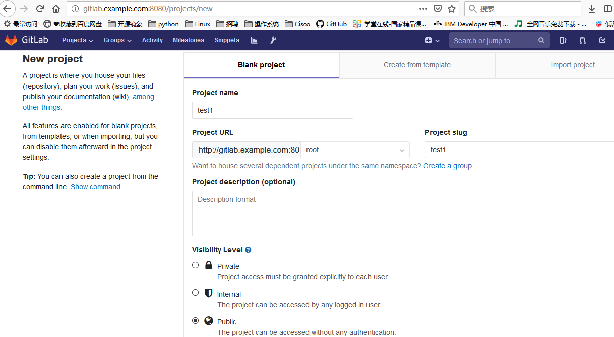
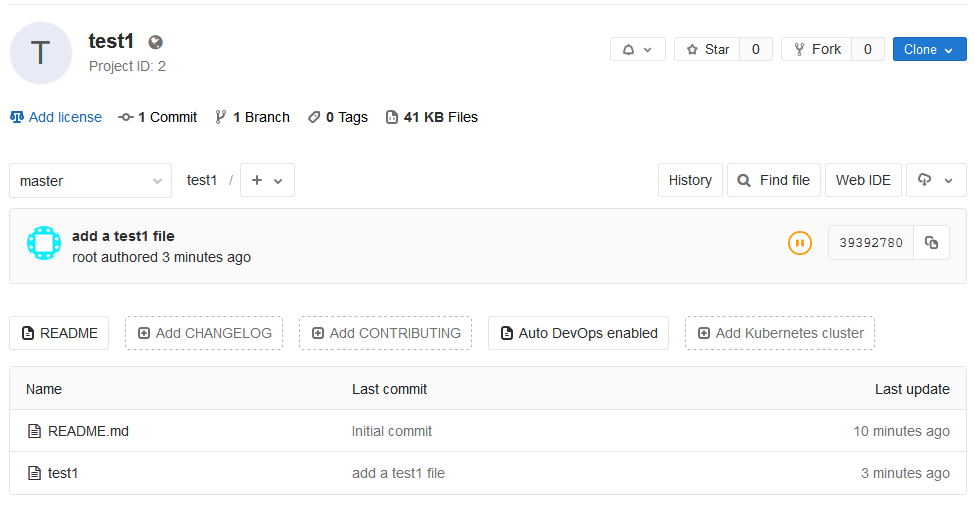

##### 参考

> https://docs.gitlab.com/omnibus/docker/

##### 环境
- CentOS 7.5 192.168.1.201
- Docker 18.09
- Gitlab 11.7.12-ce.0

##### 1、拉取gitlab镜像
```shell
[root@lab ~]# docker pull gitlab/gitlab-ce:11.7.12-ce.0
```
##### 2、创建相关目录
```shell
[root@lab ~]# mkdir /apps/gitlab{config,logs,data} -p
[root@lab ~]# cd /apps/gitlab
[root@lab gitlab]# ls
config  data  logs
```
##### 3、创建容器实例
```shell
[root@anatronics]# docker run --detach \
  --hostname gitlab.example.com \
  --publish 443:443 --publish 8080:80 --publish 2020:22 \
  --name gitlab \
  --restart always \
  --volume /apps/gitlab/config:/etc/gitlab \
  --volume /apps/gitlab/logs:/var/log/gitlab \
  --volume /apps/gitlab/data:/var/opt/gitlab \
  gitlab/gitlab-ce:11.7.12-ce.0
```
##### 4、访问页面
修改本地主机的hosts文件
```
192.168.1.201 gitlab.example.com
```
访问gitlab.example.com:8080
首次进入页面需要设置管理员密码，设置完成后，可注册登陆



##### 5、测试验证
###### 新建一个project


###### clone仓库
```shell
[root@anatronics ~]# git clone http://gitlab.example.com:8080/root/test1.git
Cloning into 'test1'...
remote: Enumerating objects: 3, done.
remote: Counting objects: 100% (3/3), done.
remote: Total 3 (delta 0), reused 0 (delta 0)
Unpacking objects: 100% (3/3), done.
[root@anatronics ~]# ls
anaconda-ks.cfg  test1
[root@anatronics ~]# cd test1/
[root@anatronics test1]# ls
README.md
[root@anatronics test1]#
```
###### 测试推送功能
```shell
[root@anatronics test1]# ls
README.md
[root@anatronics test1]# touch test1
[root@anatronics test1]# git add .
[root@anatronics test1]# git commit -m "add a test1 file"
[master 3939278] add a test1 file
 Committer: root <root@anatronics.net>
Your name and email address were configured automatically based
on your username and hostname. Please check that they are accurate.
You can suppress this message by setting them explicitly. Run the
following command and follow the instructions in your editor to edit
your configuration file:

    git config --global --edit

After doing this, you may fix the identity used for this commit with:

    git commit --amend --reset-author

 1 file changed, 0 insertions(+), 0 deletions(-)
 create mode 100644 test1
[root@anatronics test1]# git push origin
HEAD            master          origin/HEAD     origin/master
[root@anatronics test1]# git push origin
HEAD            master          origin/HEAD     origin/master
[root@anatronics test1]# git push origin master
Username for 'http://gitlab.example.com:8080': root
Password for 'http://root@gitlab.example.com:8080':
Enumerating objects: 4, done.
Counting objects: 100% (4/4), done.
Delta compression using up to 2 threads
Compressing objects: 100% (2/2), done.
Writing objects: 100% (3/3), 264 bytes | 264.00 KiB/s, done.
Total 3 (delta 0), reused 0 (delta 0)
To http://gitlab.example.com:8080/root/test1.git
   3943eec..3939278  master -> master
```



##### 6、找回密码步骤
如果是以docker方式启动的，先执行docker exec -it <容器id> bash进入容器之中。

执行gitlab-rails console
user = User.where(username: ‘root’).first
user.password = ‘password’
user.save! 