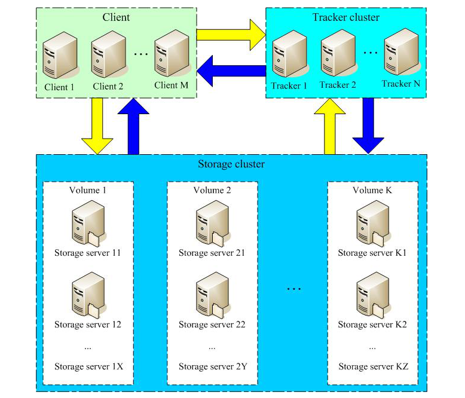
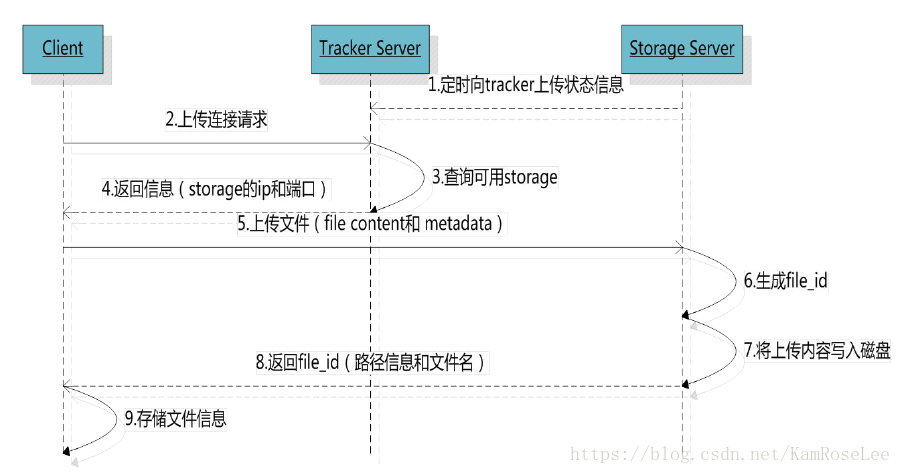
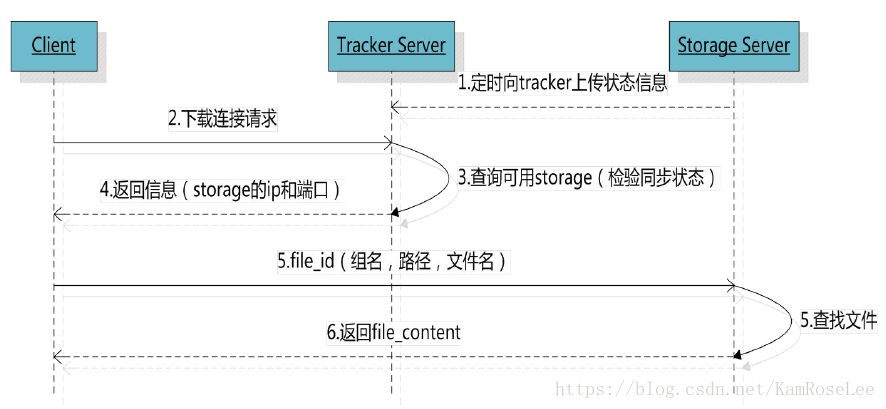

#### 环境
- 系统：CentOS 7.5 
  - 192.168.56.4 tracker storage1 node2
  - 192.168.56.3 storage2  node1
  - 防火墙，selinux禁用
- fastDFS v5.11
- nginx 1.14.2
#### 简介
FastDFS 是一个开源的高性能分布式文件系统（DFS）。 它的主要功能包括：文件存储，文件同步和文件访问，以及高容量和负载平衡。主要解决了海量数据存储问题，特别适合以中小文件（建议范围：4KB < file_size <500MB）为载体的在线服务。
FastDFS 系统有三个角色：跟踪服务器(Tracker Server)、存储服务器(Storage Server)和客户端(Client)。
- Tracker Server
  跟踪服务器，主要做调度工作，起到均衡的作用；负责管理所有的 storage server和 group，每个 storage 在启动后会连接 Tracker，告知自己所属 group 等信息，并保持周期性心跳。
- Storage Server
  存储服务器，主要提供容量和备份服务；以 group 为单位，每个 group 内可以有多台 storage server，数据互为备份。
- Client
  客户端，上传下载数据的服务器，也就是我们自己的项目所部署在的服务器。

**架构图**



**上传流程**

当Tracker收到客户端上传文件的请求时，会为该文件分配一个可以存储文件的group，当选定了group后就要决定给客户端分配group中的哪一个storage server。当分配好storage server后，客户端向storage发送写文件请求，storage将会为文件分配一个数据存储目录。然后为文件分配一个fileid，最后根据以上的信息生成文件名存储文件。



**下载流程**

tracker根据请求的文件路径即文件ID 来快速定义文件。

比如：group1/M00/00/00/wKg4BF1BUsWAZ455AJZEwwk_Q7s446.zip

1.通过组名tracker能够很快的定位到客户端需要访问的存储服务器组是group1，并选择合适的存储服务器提供客户端访问。  

2.存储服务器根据“文件存储虚拟磁盘路径”和“数据文件两级目录”可以很快定位到文件所在目录，并根据文件名找到客户端需要访问的文件



#### 1、安装相关程序

> https://github.com/happyfish100/fastdfs/blob/master/INSTALL
https://github.com/happyfish100

下载libfastcommon源码，编译安装 node1 node2两节点都进行操作

```shell
[root@node2 pkgs]# git clone https://github.com/happyfish100/libfastcommon.git
[root@node2 pkgs]# cd libfastcommon/
[root@node2 libfastcommon]# ./make.sh
[root@node2 libfastcommon]# ./make.sh install

# 创建软连接，fastDFS源码编译需要
[root@node2 fastdfs-5.11]# ln -s /usr/lib64/libfastcommon.so /usr/local/lib/libfastcommon.so
[root@node2 fastdfs-5.11]# ln -s /usr/lib64/libfastcommon.so /usr/lib/libfastcommon.so
[root@node2 fastdfs-5.11]# ln -s /usr/lib64/libfdfsclient.so /usr/lib/libfdfsclient.so
[root@node2 fastdfs-5.11]# ln -s /usr/lib64/libfdfsclient.so /usr/local/lib/libfdfsclient.so

```
下载fastDFS源码包,编译安装
```shell
[root@node2 ~]# wget https://github.com/happyfish100/fastdfs/archive/V5.11.tar.gz
[root@node2 ~]# tar xf V5.11.tar.gz
[root@node2 ~]# cd fastdfs-5.11/
[root@node2 fastdfs-5.11]# ./make.sh 
[root@node2 fastdfs-5.11]# ./make.sh install

# 生成相关命令程序
[root@node2 fastdfs-5.11]# ls /usr/bin/fdfs_*
/usr/bin/fdfs_appender_test   /usr/bin/fdfs_download_file  /usr/bin/fdfs_test1
/usr/bin/fdfs_appender_test1  /usr/bin/fdfs_file_info      /usr/bin/fdfs_trackerd
/usr/bin/fdfs_append_file     /usr/bin/fdfs_monitor        /usr/bin/fdfs_upload_appender
/usr/bin/fdfs_crc32           /usr/bin/fdfs_storaged       /usr/bin/fdfs_upload_file
/usr/bin/fdfs_delete_file     /usr/bin/fdfs_test

# 相关配置文件样例
[root@node2 fastdfs-5.11]# cd /etc/fdfs/
[root@node2 fdfs]# ls
client.conf.sample  storage.conf.sample  storage_ids.conf.sample  tracker.conf.sample
```
#### 2、配置并启动相关服务
##### 1、配置启动tracker
```shell
# 创建数据存放目录
[root@node2 fdfs]# mkdir /data/fastdfs/tracker

[root@node2 fdfs]# cp tracker.conf.sample tracker.conf
# 修改base_path
[root@node2 fdfs]# vim tracker.conf
base_path=/data/fastdfs/tracker

# 启动服务
[root@node2 fdfs]# service fdfs_trackerd start

# base_path目录下生成文件
[root@node2 fdfs]# tree /data/fastdfs/tracker/
/data/fastdfs/tracker/
├── data
│?? ├── fdfs_trackerd.pid
│?? └── storage_changelog.dat
└── logs
    └── trackerd.log
```
##### 2、配置启动storage
以下两节点都进行操作
```shell
# 创建相关目录
[root@node2 fdfs]# mkdir /data/fastdfs/{storage,file}

[root@node2 fdfs]# cp storage.conf.sample storage.conf
# 修改配置文件
[root@node2 fdfs]# vim storage.conf
base_path=/data/fastdfs/storage
store_path0=/data/fastdfs/file
tracker_server=192.168.56.4:22122

# 启动服务
[root@node2 fdfs]# service fdfs_storaged start

# 监听端口2300
[root@node2 fdfs]# ss -tlnp | grep fdfs
LISTEN     0      128          *:22122                    *:*                   users:(("fdfs_trackerd",pid=16891,fd=5))
LISTEN     0      128          *:23000                    *:*                   users:(("fdfs_storaged",pid=23318,fd=5))

# 生成下面目录
[root@node2 fdfs]# ls /data/fastdfs/file/data/
00  0C  18  24  30  3C  48  54  60  6C  78  84  90  9C  A8  B4  C0  CC  D8  E4  F0  FC
01  0D  19  25  31  3D  49  55  61  6D  79  85  91  9D  A9  B5  C1  CD  D9  E5  F1  FD
02  0E  1A  26  32  3E  4A  56  62  6E  7A  86  92  9E  AA  B6  C2  CE  DA  E6  F2  FE
03  0F  1B  27  33  3F  4B  57  63  6F  7B  87  93  9F  AB  B7  C3  CF  DB  E7  F3  FF
04  10  1C  28  34  40  4C  58  64  70  7C  88  94  A0  AC  B8  C4  D0  DC  E8  F4
05  11  1D  29  35  41  4D  59  65  71  7D  89  95  A1  AD  B9  C5  D1  DD  E9  F5
06  12  1E  2A  36  42  4E  5A  66  72  7E  8A  96  A2  AE  BA  C6  D2  DE  EA  F6
07  13  1F  2B  37  43  4F  5B  67  73  7F  8B  97  A3  AF  BB  C7  D3  DF  EB  F7
08  14  20  2C  38  44  50  5C  68  74  80  8C  98  A4  B0  BC  C8  D4  E0  EC  F8
09  15  21  2D  39  45  51  5D  69  75  81  8D  99  A5  B1  BD  C9  D5  E1  ED  F9
0A  16  22  2E  3A  46  52  5E  6A  76  82  8E  9A  A6  B2  BE  CA  D6  E2  EE  FA
0B  17  23  2F  3B  47  53  5F  6B  77  83  8F  9B  A7  B3  BF  CB  D7  E3  EF  FB

# 查看monitor信息
[root@node2 fdfs]# fdfs_monitor /etc/fdfs/storage.conf
group count: 1

Group 1:
group name = group1
disk total space = 5110 MB
disk free space = 2111 MB
trunk free space = 0 MB
storage server count = 2
active server count = 2
storage server port = 23000
storage HTTP port = 8888
store path count = 1
subdir count per path = 256
current write server index = 0
current trunk file id = 0

	Storage 1:
		id = 192.168.56.3
		ip_addr = 192.168.56.3 (node1)  ACTIVE
		http domain = 
		version = 5.11
		join time = 2019-08-01 09:23:49
		up time = 2019-08-01 09:23:49
		total storage = 5110 MB
		free storage = 2111 MB
		.....
	Storage 2:
		id = 192.168.56.4
		ip_addr = 192.168.56.4 (node2)  ACTIVE
		http domain = 
		version = 5.11

```
##### 3、配置client
```shell
[root@node2 fdfs]# mkdir /data/fastdfs/client
[root@node2 fdfs]# vim client.conf
base_path=/data/fastdfs/client
tracker_server=192.168.56.4:22122
```
##### 4、上传测试
```shell
# 在node2上传文件
[root@node2 fdfs]# fdfs_upload_file client.conf /root/wordpress-4.9.4-zh_CN.zip 
group1/M00/00/00/wKg4BF1BUsWAZ455AJZEwwk_Q7s446.zip

# 上传之后存放位置
[root@node2 fdfs]# ls /data/fastdfs/file/data/00/00/wKg4BF1BUsWAZ455AJZEwwk_Q7s446.zip 
/data/fastdfs/file/data/00/00/wKg4BF1BUsWAZ455AJZEwwk_Q7s446.zip

# 在node1上查看上传的文件
[root@node1 fdfs]# ls /data/fastdfs/file/data/00/00/wKg4BF1BUsWAZ455AJZEwwk_Q7s446.zip 
/data/fastdfs/file/data/00/00/wKg4BF1BUsWAZ455AJZEwwk_Q7s446.zip
# 文件也被同步到node1上，因为两节点同属于group1
```
返回的文件ID由group、存储目录、两级子目录、fileid、文件后缀名（由客户端指定，主要用于区分文件类型）拼接而成。
#### 3、nginx+fastdfs-module
##### 1、获取源码包
```shell
# 获取nginx源码包
[root@node2 pkgs]# wget http://nginx.org/download/nginx-1.14.2.tar.gz
[root@node2 pkgs]# tar xf nginx-1.14.2.tar.gz 

# 获取模块源码
[root@node2 pkgs]# git clone https://github.com/happyfish100/fastdfs-nginx-module.git
```
##### 2、编译安装nginx
```shell
[root@node2 pkgs]# cd nginx-1.14.2/

[root@node2 nginx-1.14.2]# ./configure --prefix=/apps/nginx --add-module=/root/pkgs/fastdfs-nginx-module/src
```
**编译报错解决**
```
# 报错
/usr/include/fastdfs/fdfs_define.h:15:27: fatal error: common_define.h: No such file or directory
 #include "common_define.h"
# 解决
[root@node2 nginx]# vim ../fastdfs-nginx-module/src/config
ngx_module_incs="/usr/include/fastdfs /usr/include/fastcommon/"
CORE_INCS="$CORE_INCS /usr/include/fastdfs /usr/include/fastcommon/"
```
##### 3、相关配置文件
###### 1、拷贝配置文件到/etc/fdfs/
```shell
# 拷贝fastdfs源码包中的文件到/etc/fdfs
[root@node2 pkgs]# cd fastdfs-5.11/
[root@node2 fastdfs-5.11]# ls
client  conf             fastdfs.spec  init.d   make.sh     README.md   stop.sh  test
common  COPYING-3_0.txt  HISTORY       INSTALL  php_client  restart.sh  storage  tracker
[root@node2 fastdfs-5.11]# cd conf
[root@node2 conf]# ls
anti-steal.jpg  client.conf  http.conf  mime.types  storage.conf  storage_ids.conf  tracker.conf
[root@node2 conf]# cp anti-steal.jpg mime.types http.conf /etc/fdfs/

# 拷贝nginx-fastdfs-module中的配置文件到/etc/fdfs下
[root@node2 ~]# cd pkgs/fastdfs-nginx-module/src/
[root@node2 src]# ls
common.c  common.h  config  mod_fastdfs.conf  ngx_http_fastdfs_module.c
[root@node2 src]# cp mod_fastdfs.conf /etc/fdfs/
```
###### 2、修改配置文件
1、在nginx.conf中添加以下内容
```
    server {
        listen 8888;
        server_name 192.168.56.4;
        location /M00 {
            ngx_fastdfs_module;
        }
    }
```
2、修改/etc/fdfs/http.conf
```shell 
[root@node2 fdfs]# vim http.conf 
http.anti_steal.token_check_fail=/etc/fdfs/anti-steal.jpg
```
3、修改/etc/fdfs/mod_fastdfs.conf 
```shell
[root@node2 fdfs]# vim mod_fastdfs.conf 
store_path0=/data/fastdfs/file
tracker_server=192.168.56.4:22122
```
##### 4、启动nginx测试
```shell
[root@node2 ~]# /apps/nginx/sbin/nginx 
```
访问一个上传的文本文件
```shell
# 上传一个文本测试文件
[root@node2 ~]# cat test.txt 
enp0s3: flags=4163<UP,BROADCAST,RUNNING,MULTICAST>  mtu 1500
        inet 192.168.56.4  netmask 255.255.255.0  broadcast 192.168.56.255
        inet6 fe80::c97:3269:2649:c9f3  prefixlen 64  scopeid 0x20<link>
        ether 08:00:27:2e:4e:8c  txqueuelen 1000  (Ethernet)
        RX packets 90480585  bytes 8142451739 (7.5 GiB)
        RX errors 0  dropped 0  overruns 0  frame 0
        TX packets 88937276  bytes 9049292916 (8.4 GiB)
        TX errors 0  dropped 0 overruns 0  carrier 0  collisions 0

lo: flags=73<UP,LOOPBACK,RUNNING>  mtu 65536
        inet 127.0.0.1  netmask 255.0.0.0
        inet6 ::1  prefixlen 128  scopeid 0x10<host>
        loop  txqueuelen 1000  (Local Loopback)
        RX packets 255341  bytes 13296404 (12.6 MiB)
        RX errors 0  dropped 0  overruns 0  frame 0
        TX packets 255341  bytes 13296404 (12.6 MiB)
        TX errors 0  dropped 0 overruns 0  carrier 0  collisions 0

[root@node2 ~]# fdfs_upload_file /etc/fdfs/client.conf test.txt 
/group1/M00/00/00/wKg4BF1CUxmAFD9-AAADlBZiHr0220.txt

[root@node2 ~]# curl http://192.168.56.4:8888/M00/00/00/wKg4BF1CUxmAFD9-AAADlBZiHr0220.txt
enp0s3: flags=4163<UP,BROADCAST,RUNNING,MULTICAST>  mtu 1500
        inet 192.168.56.4  netmask 255.255.255.0  broadcast 192.168.56.255
        inet6 fe80::c97:3269:2649:c9f3  prefixlen 64  scopeid 0x20<link>
        ether 08:00:27:2e:4e:8c  txqueuelen 1000  (Ethernet)
        RX packets 90480585  bytes 8142451739 (7.5 GiB)
        RX errors 0  dropped 0  overruns 0  frame 0
        TX packets 88937276  bytes 9049292916 (8.4 GiB)
        TX errors 0  dropped 0 overruns 0  carrier 0  collisions 0

lo: flags=73<UP,LOOPBACK,RUNNING>  mtu 65536
        inet 127.0.0.1  netmask 255.0.0.0
        inet6 ::1  prefixlen 128  scopeid 0x10<host>
        loop  txqueuelen 1000  (Local Loopback)
        RX packets 255341  bytes 13296404 (12.6 MiB)
        RX errors 0  dropped 0  overruns 0  frame 0
        TX packets 255341  bytes 13296404 (12.6 MiB)
        TX errors 0  dropped 0 overruns 0  carrier 0  collisions 0

```