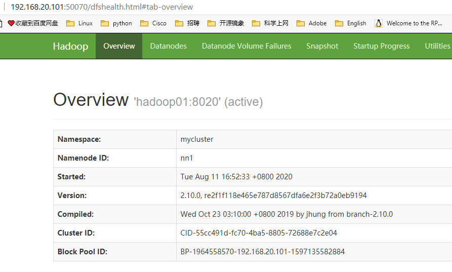

> https://hadoop.apache.org/docs/r2.10.0/hadoop-project-dist/hadoop-common/SingleCluster.html
> https://hadoop.apache.org/docs/r2.10.0/hadoop-project-dist/hadoop-common/core-default.xml
> https://hadoop.apache.org/docs/r2.10.0/hadoop-project-dist/hadoop-hdfs/hdfs-default.xml


#### HDFS架构

read 和write数据


#### 伪分布式部署 

NN DN SNN在同一台host

环境准备
访问免密
关闭防火墙和selinux
java和hadoop环境

```shell
[root@manager ~]# wget https://archive.apache.org/dist/hadoop/common/hadoop-2.10.0/hadoop-2.10.0.tar.gz
[root@manager ~]# wget https://download.java.net/openjdk/jdk8u41/ri/openjdk-8u41-b04-linux-x64-14_jan_2020.tar.gz
# 解压hadoop到/apps/hadoop
# 解压jdk到/usr/java/latest

[root@manager hadoop]# cat /etc/profile.d/java.sh 
export JAVA_HOME=/usr/java/latest
export PATH=$PATH:$JAVA_HOME/bin

[root@manager hadoop]# cat /etc/profile.d/hadoop.sh 
export HADOOP_HOME=/apps/hadoop
export PATH=$PATH:$HADOOP_HOME/bin:$HADOOP_HOME/sbin
```

#####  相关配置文件
core-site.xml

```shell
[root@manager hadoop]# vim core-site.xml 
<configuration>
    <property>
        <name>fs.defaultFS</name>
        <value>hdfs://manager:9000</value>
    </property>

    <property>
        <name>hadoop.tmp.dir</name>
        <value>/data/hadoop</value>
    </property>
</configuration>
```

hdfs-site.xml
```shell
[root@manager hadoop]# vim hdfs-site.xml 
<configuration>
    <property>
        <name>dfs.replication</name>
        <value>1</value>
    </property>
    <property>
        <name>dfs.namenode.secondary.http-address</name>
        <value>manager:50090</value>
    </property>
</configuration>
```

Datanode slave
```shell
[root@manager hadoop]# vim slaves 
manager
```

##### 格式化文件系统

```shell
[root@manager hadoop]# hdfs nodename -format
```

##### 启动NameNode和DataNode进程

```shell
[root@manager hadoop]# start-dfs.sh
```

##### 简单应用

```shell
创建目录
hdfs dfs -mkdir /user
hdfs dfs -mkdir /user/root
上传文件
hdfs dfs -put [xxxxxx]
```


#### HDFS-HA QJM集群搭建
(Quorum Journal Manager)
> https://hadoop.apache.org/docs/r2.10.0/hadoop-project-dist/hadoop-hdfs/HDFSHighAvailabilityWithQJM.html


##### 准备

节点规划

- hadoop01 192.168.20.101  NN DN ZK ZKFC JN
- hadoop02 192.168.20.105  NN DN ZK ZKFC JN
- hadoop03 192.168.20.106  DN ZK JN
NN namenode
DN datanode
ZK zookeeper
ZKFC zookeeper failover controller
JN journalNode

免密互访
时间同步

hosts解析
```shell
vim /etc/hosts
192.168.20.101 hadoop01
192.168.20.105 hadoop02
192.168.20.106 hadoop03
```

##### zookeeper集群搭建

##### 配置文件

配置core-site.xml

```shell
[root@hadoop01 hadoop]# cat core-site.xml 
<configuration>
    <property>
        <name>fs.defaultFS</name>
        <value>hdfs://mycluster</value>
    </property>

    <property>
        <name>hadoop.tmp.dir</name>
        <value>/data/hadoop</value>
    </property>

 <property>
   <name>ha.zookeeper.quorum</name>
   <value>hadoop01:2181,hadoop02:2181,hadoop03:2181</value>
 </property>
```

配置hdfs-site.xml
```shell
[root@hadoop01 hadoop]# cat hdfs-site.xml

<configuration>
    <property>
        <name>dfs.replication</name>
        <value>2</value>
    </property>
    <property>
	<name>dfs.nameservices</name>
	<value>mycluster</value>
    </property>

<property>
  <name>dfs.ha.namenodes.mycluster</name>
  <value>nn1,nn2</value>
</property>

<property>
  <name>dfs.namenode.rpc-address.mycluster.nn1</name>
  <value>hadoop01:8020</value>
</property>
<property>
  <name>dfs.namenode.rpc-address.mycluster.nn2</name>
  <value>hadoop02:8020</value>
</property>

<property>
  <name>dfs.namenode.http-address.mycluster.nn1</name>
  <value>hadoop01:50070</value>
</property>
<property>
  <name>dfs.namenode.http-address.mycluster.nn2</name>
  <value>hadoop02:50070</value>
</property>

<property>
  <name>dfs.namenode.shared.edits.dir</name>
  <value>qjournal://hadoop01:8485;hadoop02:8485;hadoop03:8485/mycluster</value>
</property>

<property>
  <name>dfs.client.failover.proxy.provider.mycluster</name>
  <value>org.apache.hadoop.hdfs.server.namenode.ha.ConfiguredFailoverProxyProvider</value>
</property>

<property>
  <name>dfs.journalnode.edits.dir</name>
  <value>/data/hadoop/dfs/journalnode</value>
</property>

    <property>
      <name>dfs.ha.fencing.methods</name>
      <value>sshfence</value>
    </property>

    <property>
      <name>dfs.ha.fencing.ssh.private-key-files</name>
      <value>/root/.ssh/id_rsa</value>
    </property>

 <property>
   <name>dfs.ha.automatic-failover.enabled</name>
   <value>true</value>
 </property>

```
配置文件copy到其它节点

##### 启动

###### 1 启动JN

```shell
[root@hadoop01 hadoop]# hadoop-daemon.sh start journalnode
[root@hadoop02 hadoop]# hadoop-daemon.sh start journalnode
[root@hadoop03 hadoop]# hadoop-daemon.sh start journalnode
```
###### 2 选择一台NN进行格式化

```shell
[root@hadoop01 hadoop]# hdfs namenode -format
```
###### 3 启动之前格式化的NN守护进程

```shell
[root@hadoop01 hadoop]# hadoop-daemon.sh start namenode
# /data/hadoop
[root@hadoop01 hadoop]# tree
.
└── dfs
    ├── journalnode
    │   └── mycluster
    │       ├── current
    │       │   ├── committed-txid
    │       │   ├── paxos
    │       │   └── VERSION
    │       └── in_use.lock
    └── name
        ├── current
        │   ├── fsimage_0000000000000000000
        │   ├── fsimage_0000000000000000000.md5
        │   ├── seen_txid
        │   └── VERSION
        └── in_use.lock
```
###### 4 启动standby node

```shell
[root@hadoop02 data]# hdfs namenode -bootstrapStandby

#查看数据已同步过来
[root@hadoop02 hadoop]# tree
.
└── dfs
    ├── journalnode
    │   └── mycluster
    │       ├── current
    │       │   ├── committed-txid
    │       │   ├── paxos
    │       │   └── VERSION
    │       └── in_use.lock
    └── name
        └── current
            ├── fsimage_0000000000000000000
            ├── fsimage_0000000000000000000.md5
            ├── seen_txid
            └── VERSION

7 directories, 7 files
```
###### 5 格式化zk

```shell
[root@hadoop01 hadoop]# hdfs zkfc -formatZK

# 查看zk
zkCli.sh
WatchedEvent state:SyncConnected type:None path:null
[zk: localhost:2181(CONNECTED) 0] ls /
[hadoop-ha, zookeeper]
[zk: localhost:2181(CONNECTED) 1] ls /hadoop-ha
[mycluster]
```
###### 6 启动dfs

```shell
[root@hadoop01 hadoop]# start-dfs.sh
Starting namenodes on [hadoop01 hadoop02]
hadoop01: namenode running as process 6415. Stop it first.
hadoop02: starting namenode, logging to /apps/hadoop-2.10.0/logs/hadoop-root-namenode-hadoop02.out
hadoop01: starting datanode, logging to /apps/hadoop-2.10.0/logs/hadoop-root-datanode-hadoop01.out
hadoop03: starting datanode, logging to /apps/hadoop-2.10.0/logs/hadoop-root-datanode-hadoop03.out
hadoop02: starting datanode, logging to /apps/hadoop-2.10.0/logs/hadoop-root-datanode-hadoop02.out
Starting journal nodes [hadoop01 hadoop02 hadoop03]
hadoop01: journalnode running as process 6232. Stop it first.
hadoop02: journalnode running as process 2081. Stop it first.
hadoop03: journalnode running as process 2745. Stop it first.
Starting ZK Failover Controllers on NN hosts [hadoop01 hadoop02]
hadoop02: starting zkfc, logging to /apps/hadoop-2.10.0/logs/hadoop-root-zkfc-hadoop02.out
hadoop01: starting zkfc, logging to /apps/hadoop-2.10.0/logs/hadoop-root-zkfc-hadoop01.out

[root@hadoop01 hadoop]# jps
7237 Jps
6232 JournalNode
5802 QuorumPeerMain
6859 DataNode
7164 DFSZKFailoverController
6415 NameNode


# 再次查看zk数据变化
[zk: localhost:2181(CONNECTED) 3] ls /hadoop-ha/mycluster
[ActiveBreadCrumb, ActiveStandbyElectorLock]
```

###### 查看




###### 一些命令

```shell
hadoop-daemon.sh start namenode
hadoop-daemon.sh start zkfc
```

