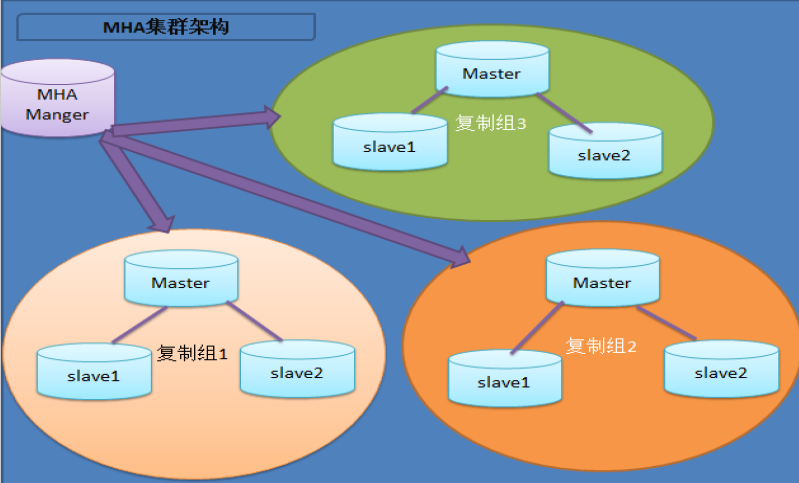

#### MHA 实现Mariadb一主多从切换

##### MHA简介

MasterHA，对主节点进行监控，可实现自动故障转移至其它从节点；通过提升某一从节点为新的主节点，基于主从复制实现，还需要客户端配合实现，目前MHA主要支持一主多从的架构，要搭建MHA,要求一个复制集群中必须最少有三台数据库服务器，一主二从，即一台充当master，一台充当备用master，另外一台充当从库

##### 架构图：



##### 原理

1. 从宕机崩溃的master保存二进制日志事件（binlog events）
2. 识别含有最新更新的slave
3. 应用差异的中继日志（relay log）到其他的slave
4. 应用从master保存的二进制日志事件（binlog events）
5. 提升一个slave为新的master
6. 使其他的slave连接新的master进行复制

##### 组成

MHA软件由两部分组成，Manager工具包和Node工具包
Manager工具包主要包括以下几个工具：

1. masterha_check_ssh 检查MHA的SSH配置状况
2. masterha_check_repl 检查MySQL复制状况
3. masterha_manger 启动MHA
4. masterha_check_status 检测当前MHA运行状态
5. masterha_master_monitor 检测master是否宕机
6. masterha_master_switch 制故障转移（自动或手动）
7. masterha_conf_host 添加或删除配置的server信息

##### 环境

- CentOS7.5
- MHA MANAGER 192.168.1.201
- Mariadb 5.6（主从已经配置完成 一主二从）  MHA NODE
  - master  192.168.56.3   
  - slave node1 192.168.56.4  （mha中备用主）
  - slave node2 192.168.56.100

##### 实验过程

###### 1、mariadb 相关准备

master my.cnf

```shell
[mysqld]
datadir=/var/lib/mysql
socket=/var/lib/mysql/mysql.sock
innodb_file_per_table=on
skip_name_resolve=on
log-bin=mysql-bin
binlog_format=mixed
server-id       = 1
```

node1 (mha 备用主节点)

```shell

[mysqld]
datadir=/var/lib/mysql
socket=/var/lib/mysql/mysql.sock
symbolic-links=0
innodb_file_per_table=on
skip_name_resolve=on
log-bin=mysql-bin
read_only
binlog_format=mixed
server-id       = 2
relay_log_purge=0
```

node2 

```shell
[mysqld]
datadir=/var/lib/mysql
socket=/var/lib/mysql/mysql.sock
innodb_file_per_table=on
skip_name_resolve=on
log-bin=mysql-bin
binlog_format=mixed
server-id       = 3
read_only
relay_log_purge=0
```

创建MHA管理账号

```shell
MariaDB [(none)]> GRANT ALL ON *.* TO 'mha'@'192.168.%.%' IDENTIFIED BY 'mha';
Query OK, 0 rows affected (0.02 sec)
MariaDB [(none)]> FLUSH PRIVILEGES;
Query OK, 0 rows affected (0.01 sec)
```

###### 2、配置mha manager节点和所有mariadb之间的访问互信

```shell
# mha节点执行
ssh-keygen -t rsa
ssh-copy-i -i 192.168.56.3
ssh-copy-i -i 192.168.56.4
ssh-copy-i -i 192.168.56.100
```

###### 3、下载相关rpm包

```shell
wget https://storage.googleapis.com/google-code-archive-downloads/v2/code.google.com/mysql-master-ha/mha4mysql-manager-0.55-1.el5.noarch.rpm

wget https://storage.googleapis.com/google-code-archive-downloads/v2/code.google.com/mysql-master-ha/mha4mysql-node-0.54-1.el5.noarch.rpm
```

###### 4、MHA相关包安装

```shell
# 在mha manager节点上安装mha4mysql-manager-0.55 mha4mysql-node-0.54 需要开启epel源
yum install mha4mysql* -y
# 在所有mariadb服务主机上安装mha4mysql-node-0.54
yum install mha4mysql-node-0.54-1.el5.noarch.rpm -y
```

###### 5、在mha manager节点上创建配置文件

```shell
# vim /etc/mha/mha.cnf 
[server default]
user=mha
password=mha
manager_workdir=/data/mha
manager_log=/data/mha/manager.log
remote_workdir=/data/mha
ssh_user=root
repl_user=repluser
repl_password=centos
ping_interval=1

[server1]
hostname=192.168.56.3
candidate_master=1

[server2]
hostname=192.168.56.4
candidate_master=1

[server3]
hostname=192.168.56.100
```

###### 6、检查ssh status   masterha_check_ssh命令

```shell
# masterha_check_status --conf=/etc/my.cnf
#报错
Can't locate MHA/ManagerConst.pm in @INC (@INC contains: /usr/local/lib64/perl5 /usr/local/share/perl5 /usr/lib64/perl5/vendor_perl /usr/share/perl5/vendor_perl /usr/lib64/perl5 /usr/share/perl5 .) at /usr/bin/masterha_check_status line 25.
BEGIN failed--compilation aborted at /usr/bin/masterha_check_status line 25.
#解决
export PERL5LIB=$PERL5LIB:/usr/lib/perl5/vendor_perl/

#报错
Maybe MHA Node package is not installed?
#解决
ln -s /usr/lib/perl5/vendor_perl/MHA /usr/lib64/perl5/vendor_perl/
```

再次执行masterha_check_ssh

```shell
[root@lab ~]# masterha_check_ssh --conf=/etc/mha/mha.cnf 
...
Fri Apr 26 11:11:17 2019 - [debug]  Connecting via SSH from root@192.168.56.3(192.168.56.3:22) to root@192.168.56.100(192.168.56.100:22)..
Fri Apr 26 11:11:18 2019 - [debug]   ok.
Fri Apr 26 11:11:40 2019 - [debug] 
Fri Apr 26 11:11:18 2019 - [debug]  Connecting via SSH from root@192.168.56.100(192.168.56.100:22) to root@192.168.56.3(192.168.56.3:22)..
Fri Apr 26 11:11:28 2019 - [debug]   ok.
Fri Apr 26 11:11:28 2019 - [debug]  Connecting via SSH from root@192.168.56.100(192.168.56.100:22) to root@192.168.56.4(192.168.56.4:22)..
Fri Apr 26 11:11:39 2019 - [debug]   ok.
Fri Apr 26 11:11:40 2019 - [info] All SSH connection tests passed successfully.
```

###### 7、检查mysql replication健康状态     masterha_check_repl命令

```shell
[root@lab mha]# masterha_check_repl --conf=/etc/mha/mha.cnf 
...
192.168.56.3 (current master)
 +--192.168.56.4
 +--192.168.56.100

Fri Apr 26 11:39:29 2019 - [info] Checking replication health on 192.168.56.4..
Fri Apr 26 11:39:29 2019 - [info]  ok.
Fri Apr 26 11:39:29 2019 - [info] Checking replication health on 192.168.56.100..
Fri Apr 26 11:39:29 2019 - [info]  ok.
Fri Apr 26 11:39:29 2019 - [warning] master_ip_failover_script is not defined.
Fri Apr 26 11:39:29 2019 - [warning] shutdown_script is not defined.
Fri Apr 26 11:39:29 2019 - [info] Got exit code 0 (Not master dead).

MySQL Replication Health is OK.
```

###### 8、启动mha manger    masterha_manager 命令

```shell
[root@lab mha]# masterha_manager --conf=/etc/mha/mha.cnf
Fri Apr 26 11:48:43 2019 - [warning] Global configuration file /etc/masterha_default.cnf not found. Skipping.
Fri Apr 26 11:48:43 2019 - [info] Reading application default configurations from /etc/mha/mha.cnf..
Fri Apr 26 11:48:43 2019 - [info] Reading server configurations from /etc/mha/mha.cnf..

# 查看运行状态
[root@lab ~]# masterha_check_status --conf=/etc/mha/mha.cnf
mha (pid:20122) is running(0:PING_OK), master:192.168.56.3

```

###### 9、模拟测试

在192.168.56.3上执行,停止mariadb服务

```shell
systemctl stop mariadb
```

观察mha manager节点

```shell
[root@lab mha]# masterha_manager --conf=/etc/mha/mha.cnf
Fri Apr 26 11:48:43 2019 - [warning] Global configuration file /etc/masterha_default.cnf not found. Skipping.
Fri Apr 26 11:48:43 2019 - [info] Reading application default configurations from /etc/mha/mha.cnf..
Fri Apr 26 11:48:43 2019 - [info] Reading server configurations from /etc/mha/mha.cnf..
  Creating /data/mha if not exists..    ok.
  Checking output directory is accessible or not..
   ok.
  Binlog found at /var/lib/mysql, up to mysql-bin.000004
Fri Apr 26 11:52:22 2019 - [warning] Global configuration file /etc/masterha_default.cnf not found. Skipping.
Fri Apr 26 11:52:22 2019 - [info] Reading application default configurations from /etc/mha/mha.cnf..
Fri Apr 26 11:52:22 2019 - [info] Reading server configurations from /etc/mha/mha.cnf..

[root@lab ~]# masterha_check_status --conf=/etc/mha/mha.cnf
mha master is down and failover is running(50:FAILOVER_RUNNING). master:192.168.56.3
Check /data/mha/manager.log for details.
```

在192.168.56.100上查看mariadb slave status,发现master已切换到192.168.56.4的备用master上了

```shell
MariaDB [(none)]> show slave status\G
*************************** 1. row ***************************
               Slave_IO_State: Waiting for master to send event
                  Master_Host: 192.168.56.4
                  Master_User: repluser
                  Master_Port: 3306
                Connect_Retry: 60
              Master_Log_File: mysql-bin.000003
          Read_Master_Log_Pos: 245
               Relay_Log_File: mariadb-relay-bin.000002
                Relay_Log_Pos: 529
        Relay_Master_Log_File: mysql-bin.000003
             Slave_IO_Running: Yes
            Slave_SQL_Running: Yes
```

原主库修复好重新上线后，将其作为新master的slave  change master to 新master，删除mha日志文件目录中的mha.failover.complete文件，原主库开启read-only。