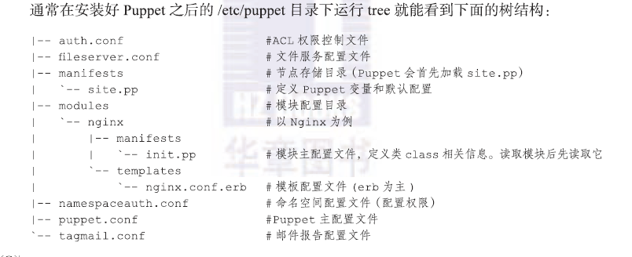

puppet数据流：
	1、node节点将facts和本机信息发送给master
	2、master告诉node节点应该如何配置，将这些信息写入catalog后传给node
	3、node节点在本机进行代码解析验证并执行，将结果反馈给master
	4、maser通过API将数据发给分析工具。
整个数据流的走向是基于SSL安全协议的。

centos7.5

- 服务端 lab1 192.168.10.200
- 客户端 lab2 192.168.10.201

配置/etc/hosts

```shell
192.168.10.201 lab2
192.168.10.200 lab1
```

配置ssh互信

**服务端master**

```shell
yum install puppet-server -y
```
修改配置文件/etc/puppet/puppet.conf
在[main]段中添加
```
modulepath = /etc/puppet/modules:/usr/share/puppet/modules
```
启动puppetmaster服务
```shell
systemctl start puppetmaster 
```
监听端口：8140

**客户端client**
```
yum install puppet -y
```
修改配置文件/etc/puppet/puppet.conf
在[agent]段中添加
```
server = 192.168.10.200
```
启动服务
```shell
systemctl start puppetagent
```

Puppet服务证书请求与签名
在客户端进行注册
```shell
puppet agent --server=lab1 --no-daemonize --verbose --debug
```
可以在master端可以查看申请注册的客户端
```
puppet cert --list
```
在master端进行签发认证申请
```shell
puppet cert sign lab2
```
签名多个客户端时 可以使用 
```shell
puppet cert sign --all
```
在客户端查看debug信息
```
Debug: Finishing transaction 29555540
Debug: Failed to load library 'msgpack' for feature 'msgpack'
Debug: Puppet::Network::Format[msgpack]: feature msgpack is missing
Debug: catalog supports formats: pson b64_zlib_yaml yaml dot raw
Info: Caching catalog for lab2
Debug: Creating default schedules
Debug: Loaded state in 0.01 seconds
Info: Applying configuration version '1551520765'
Debug: Finishing transaction 30176180
Debug: Storing state
Debug: Stored state in 0.02 seconds
Notice: Finished catalog run in 0.06 seconds
```

客户端签名验证失败时，需要重新签名，要删除$hostname.pem证书,服务端同样也要删除
```shell
find  /var/lib/puppet/ssl/ -iname lab2.pem -exec rm -f {} \;
​```shell

查看已签发的证书
​```shell
# ll /var/lib/puppet/ssl/ca/signed/
total 8
-rw-r--r--. 1 puppet puppet 1923 Mar  2 17:16 lab1.pem
-rw-r--r--. 1 puppet puppet 1923 Mar  2 17:23 lab2.pem
```
资源定义
　　资源定义通过向资源类型的属性赋值来实现，可称为资源类型实例化；
　　定义了资源实例的文件即清单，manifest；
　　定义资源的语法如下：
```
type {'title':
	attribute1 	=> value1,
	atrribute2	=> value2,
	……
}
注意：type必须使用小写字符；title是一个字符串，在同一类型中必须惟一；每一个属性之间需要用“,”隔开，最后一个“,”可省略
```

资源属性中的三个特殊属性：
Namevar：可简称为name；
ensure：资源的目标状态；
Provider：指明资源的管理接口；

查看资源类型
puppet describe
			-l: 列出所有资源类型
			-s: 显示指定类型的简要帮助信息
			-m: 显示指定类型的元参数，一般与-s一同使用
			
常见的资源类型：
	file
	package
	service
	user
	group
	exec
	cron

资源引用：
	Type['title']

facter信息查看  facter - Gather system information
facter 	

puppet中也提供了before、require、notify和subscribe四个参数来定义资源之间的依赖关系和通知关系。
before：表示需要依赖于某个资源
require：表示应该先执行本资源，在执行别的资源
notify：A notify B：B依赖于A，且A发生改变后会通知B；
subscribe：B subscribe A：B依赖于A，且B监控A资源的变化产生的事件；

<<<<<<< HEAD

=======

>>>>>>> 5a42b05d55ee1710313e4a949b2864979a07fd8e


**简单举例**
***example 1***

```shell
vim httpd.pp
##创建文件
file {
    "/etc/httpd/conf/httpd.conf":
        ensure => file,
        source => "/root/puppet/httpd.conf",
        #当httpd.conf文件发生变化 通知httpd service refresh
        notify => Service['httpd']
}
```
##管理服务

```shell
service{
    "httpd":
        ensure => running,
}	
```
```shell
puppet apply --verbose --debug httpd.pp
```
```shell
vim user.pp
##创建用户
user {
    "puppet1":
        system => true,
        gid => puppet1,
        ensure => present,
        ## 定义依赖关系 require 指定依赖的资源
        require => Group['puppet1']
}
创建用户组
group {
    "puppet1":
        system => true,
        gid => 9898,
        ensure => present,
        ## 定义资源间依赖关系 ，before指定资源之前先执行
        #before => User['puppet1']
}
创建puppet1用户和用户组，并指定依赖关系

执行
puppet apply --verbose --debug user.pp

vim exec_demo.pp
##执行命令
exec {
    "create_file":
        command => "touch /tmp/exec.txt",
        path => '/bin:/sbin:/usr/bin:/usr/sbin',
        user => "root",
        creates => '/tmp/exec.txt'
}

vim cron_demo.pp
##定义计划任务
cron {
    "sync_time":
        command => "/usr/sbin/ntpdate ntp1.aliyun.com &> /dev/null",
        name => "synctime from aliyun",
        minute => "*/3",

        #当为absent时，表示移除计划任务
        #ensure => "absent"
}
```
***example 2***

```shell
[root@lab puppet]# pwd
/etc/puppet
[root@lab puppet]# tree
.
├── auth.conf
├── fileserver.conf
├── manifests
│   ├── nodes
│   │   └── client.pp
│   └── site.pp
├── modules
│   └── test
│       ├── files
│       │   └── hosts
│       ├── manifests
│       │   └── init.pp
│       └── templates
│           └── test.erb
└── puppet.conf
mkdir /etc/puppet/modules/test/{files,manifests,templates} -pv
mkdir /etc/puppet/manifests/nodes -pv

创建test modules中init.pp 定义一个test类 
# vim /etc/puppet/modules/test/manifests/init.pp 
class test {
    file {
        "/tmp/$hostname.hosts":
            ensure => file,
            source => "puppet:///modules/test/hosts"
    }
}

定义模板变量
# vim/etc/puppet/modules/test/templates/test.erb
hostname <%= fqdn %>

引用的文件放在/etc/puppet/modules/test/files/下
# cp /etc/hosts /etc/puppet/modules/test/files/

指定节点要执行的module default表示所有客户端
# vim /etc/puppet/manifests/nodes/client.pp 
node default {
	include test
}

创建主清单文件 import 指定要包含nodes目录下哪些.pp文件
# vim /etc/puppet/manifests/site.pp 
import "nodes/*.pp"

在各客户端执行 systemctl restart puppetagent
```
---------------------------------------------------------------

多环境配置：
	默认环境是production；	

	environmentpath =	

puppet 3.4 之前的版本配置多环境的方法： 
```	shell
	各环境配置：
		/etc/puppet/environments/{production,development,test}
		
	master支持多环境：puppet.conf
		[master]
		# modulepath=
		# manifest=
		environments = production, development, testing
		
		[production]
		modulepath=/etc/puppet/environments/production/modules/
		manifest=/etc/puppet/environments/production/manifests/site.pp
		
		[development]
		modulepath=/etc/puppet/environments/development/modules/
		manifest=/etc/puppet/environments/development/manifests/site.pp	
		
		[testing]
		modulepath=/etc/puppet/environments/testing/modules/
		manifest=/etc/puppet/environments/testing/manifests/site.pp	
```
puppet 3.6之后的版本配置多环境的方法：
```shell
master支持多环境：
		(1) 配置文件puppet.conf
		[master]
		environmentpath = $confdir/environments
		
		(2) 在多环境配置目录下为每个环境准备一个子目录
		ENVIRONMENT_NAME/
			manifests/
				site.pp
			modules/
										
agent端：
	[agent]
	environment = { production|development | testing }
```

puppet config print 可以查看配置信息
pupet config print |  grep environment 查看关于环境的配置信息	

配置多环境前：

```shell
[root@lab puppet]# puppet config print| grep environment
environment = production
environmentpath =
environment_timeout = 180
```

配置多环境后：

```shell
[root@lab environments]# puppet config print| grep environment
environment = production
environmentpath = /etc/puppet/environments
environment_timeout = 180
manifest = /etc/puppet/environments/production/manifests
modulepath = /etc/puppet/environments/production/modules:/etc/puppet/modules:/usr/share/puppet/modules
```


简单例子

```shell
[root@lab environments]# pwd
/etc/puppet/environments
[root@lab environments]# tree
.
├── development
│   ├── manifests
│   │   └── site.pp
│   └── modules
│       └── test
│           └── manifests
│               └── init.pp
├── production
│   ├── manifests
│   │   └── site.pp
│   └── modules
│       └── test
│           └── manifests
│               └── init.pp
└── test
    ├── manifests
    └── modules

site.pp是一样的
{development,production}/manifests/site.pp
node 'lab' {
    include test
}

init.pp不同		
vim development/modules/test/manifests/init.pp
class test {
    file{
        "/tmp/environment.txt":
            content => "development env\n"
    }
}		

vim production/modules/test/manifests/init.pp
class test {
    file{
        "/tmp/environment.txt":
            content => "production env\n"
    }
}

当在puppet.conf中添加：
[agent]
		environment = production
执行结果
[root@lab puppet]# cat /tmp/environment.txt
production env

当在puppet.conf中修改：
[agent]
		environment = development
执行结果
[root@lab puppet]# cat /tmp/environment.txt
development env
```

**puppet kick**
 puppet客户端默认每30分钟跟服务器通讯一次，但是有时，我们希望服务端能给客户端紧急推送一些任务，于是就有了puppet kick（puppet 2.6以前叫puppetrun）。

```shell
编辑客户端/etc/puppet/puppet.conf
    在[agent]后面添加   
    listen = true  //这个是让puppet监听8139端口 

编辑或新建文件/etc/puppet/namespaceauth.conf，包含下面内容
    [puppetrunner] 
    allow *.domain.com 

编辑文件auth.conf
    path /run 
    method save 
    allow puppet.domain.com 
     
# this one is not stricly necessary, but it has the merit 
# to show the default policy which is deny everything else 

   path / 
   auth any 

推送方法，在服务端运行命令
puppet kick -p 10 -–host 客户端 
或    
puppetrun -p 10 -–host 客户端 
```

