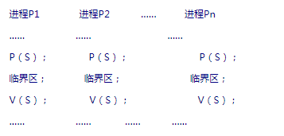

> https://blog.csdn.net/cs_hnu_scw/article/details/80204038 

##### 一：信号量的本质

?       信号量（semaphore）的数据结构为一个值和一个指针，指针指向等待该信号量的下一个进程。信号量的值与相应资源的使用情况有关。当它的值大于0时，表示当前可用资源的数量；当它的值小于0时，其绝对值表示等待使用该资源的进程个数。注意，信号量的值仅能由PV操作来改变。
##### 二：信号量机制的功能
?        进程间通信处理同步互斥的机制。信号量是一个计数器，可以用来控制多个进程对共享资源的访问。它常作为一种锁机制，防止某进程正在访问共享资源时，其他进程也访问该资源。
##### 三：PV操作的含义
   PV操作由P操作原语和V操作原语组成（原语是不可中断的过程），针对信号量进行相应的操作。
##### 四：PV操作的定义
其中S表示信号量的值，P表示P操作，V表示V操作；

###### P（S）：

- ①将信号量S的值减1，即进行S = S-1；
- ②如果S < 0，则该进程进入阻塞队列；
- ③如果S >= 0, 则该进程继续执行；
- ④执行一次P操作其实就是意味请求分配一个资源，所以针对②和③来说就好理解了，当信号量的值小于0，那么就表示没有可用资源，那么进程就只能进行等待其他拥有该资源的进程释放资源之后，才能进行执行；当信号量大于0的时候，那么表示还有足够的资源，所以，当前进程就可以继续执行；

###### V（S）：

- ①将信号量S的值加1，即 S = S + 1；

- ②如果S > 0，则该进程继续执行；
- ③如果S < 0, 则释放阻塞队列中的第一个等待信号量的进程；
- ④执行一次V操作其实就是意味释放一个资源，所以针对②和③来说就好理解了，当信号量的值大于0，那么就表示有可用资源，那么表示信号量的资源足够进程进行申请，就不需要将进程进行放入到阻塞队列中；而当信号量小于0的时候，就表示针对这个信号量，还有其他的进程是已经进行了申请信号量的操作，而只是之前是无法满足进程获取资源的，简单点说，就是表示阻塞队列中还有其他的进程是执行了P操作，在等待信号量，所以，这样的话，就讲阻塞队列中的第一个等待信号量的进程进行处理即可；

?       我觉得，通过我上面对PV操作以及信号量的解释，大家应该对整个的过程有了一个简单的理解了，可能这里面有点绕，但是好好的读一下我写的，慢慢的揣摩下，应该就理解了，这可能和我们平常的逻辑不是非常的切合，但是，理解了就会觉得，其实这就是PV操作的一个好处。下面，我用一个例子来帮大家更好的理解一下。

##### 五：实例分析信号量和PV操作之间的处理过程
实例：现在有三个进程分别是A,B,C，它们三者都是需要信号量S的临界资源，而信号量的初值为1（所以，当它们三者进行申请资源的时候，也就只会让一个进程得到资源进行执行）
第一步：很幸运，A首先进入临界资源中，那么它就需要执行P操作之后，所以，此时信号量就变成S = 0；  
第二步：而后B也进入临界资源，但是A还没有将资源释放，B执行了P操作进行申请资源，所以，此时信号量就变成S = -1；  
第三步：同理，而后C也进入临界资源，但是A还没有将资源释放，C执行了P操作进行申请资源，所以，此时信号量就变成S = -2；  
（通过前面三步，这时候的情况就是，A在正常执行，但是还没执行完成并没有释放资源，而B和C都是出于阻塞队列，因为没有足够的资源呀，所以，这里是不是很好理解呢？那么，很好，我们继续！）  
第四步：哇塞，A终于执行完成了，那么由于PV操作必须是成对出现的，所以，A肯定是要执行V操作的，所以此时，A将资源释放出来，那么信号量就变成了 S = -1 （因为第三步的时候S=-2，而执行V操作就是相当于释放一个资源，所以这里就变成-1，这个理解不难吧）  
第五步：因为A执行了V操作，那么就会唤醒阻塞队列中第一个进行等待的进程，那么从前面可以得到，是B先等待的，所以自然而然的就将B进行唤醒，所以，这时候，B就开始进入临界区进行相应的执行处理；（我觉得，有可能有朋友会问，那现在B进行临界区操作了，那么不应该要先执行P操作获取资源才可以吗？大家，请注意一下，并不是的，因为B我们知道，它其实是从阻塞队列中被唤醒出来的，而它之所以进入到阻塞队列，就是因为之前执行了P操作，导致那时候没有足够的信号量让其能够进行执行，所以，现在只是相当于唤醒操作，就不需要再一次进行P操作，就类似我们进程中的从就绪状态变成执行状态了。因为A执行了V操作，B就从阻塞到就绪，当有资源的时候，那么B自然就可以进入到运行状态了，这样理解是不是就比较好了呢？---注意：这是打个比方来帮助大家理解）  
第六步：B执行完成之后，同样，再进行V操作，所以，此时，信号量 S = 0  
第七步：由于B执行了V操作，那么唤醒了阻塞队列中的第一个等待进程，即是C，所以这时候，C就获得了临界区的资源，那么就可以开始执行了；  
第八步：C执行完成之后，同样，再进行V操作，所以，此时，信号量 S = 1  
第九步：三个进程都执行完成了，并且阻塞队列也没有等待进程，这样是不是就实现了进程之间的通信呢？并且，有没有发现，从开始到结束的时候，信号量的值是没有改变的，都是S = 1。这样，是不是就很好理解了？有说到的内容，信号量的值其实是不会发生改变的。。到这里，基本上，进程的通信就可以完成了，PV操作也都结束了。
我想，有可能有些朋友会问，如果现在又有进程D到来了并且它也是需要ABC一样的临界资源，此时又是如何的呢?  
第十步：很简单，因为这时候S = 1 ，而 S > 0，那么这时候D来了的话，就可以直接执行啦，即执行P操作，这样 S = 0，然后D执行它需要的操作，执行完成之后再进行V操作，即释放资源，这时候 S = 1，所以，又回来这样的情况啦。  
第十一步：针对第十步的情况，如果此时，又有一个进程E来了（哇塞，这么多，很可恶~~），又会发生什么呢？其实，只要我们明白了工作原理，很容易就理解的了，那么由于这时候 S = 0 ，无法让E继续执行，所以E先执行P操作，S = -1，然后就被放入到阻塞队列去了，而当D使用资源之执行完成之后，由于D执行了V操作，所以S = 0 ，这时候唤醒等待队列的第一个，所以E就获得了执行的机会，那么E就开始执行，执行完成之后进行V操作，所以，S = 1 ,很明显，又是到最初的状态啦。

总结：我觉得，我通过这个例子来进行解释的话，应该够大家理解了里面的工作原理了吧。并且，我还针对不同的情况进行了分析，朋友，如果还不懂，那么就请你再多读几遍哦？如果，还读不懂，那么就算我输好了~~哈哈~~
##### 六：信号量和PV操作实现进程通信（其实就是进程互斥）的模型

温馨提示：使用PV操作实现进程互斥时应该注意的是：

1. 每个程序中用户实现互斥的P、V操作必须成对出现，先做P操作，进临界区，后做V操作，出临界区。若有多个分支，要认真检查其成对性。
2. P、V操作应分别紧靠临界区的头尾部，临界区的代码应尽可能短，不能有死循环。
3. 互斥信号量的初值一般为1。
