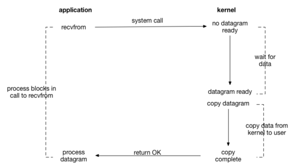
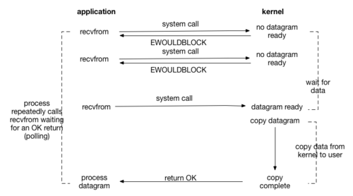
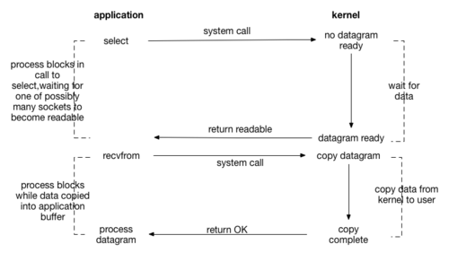
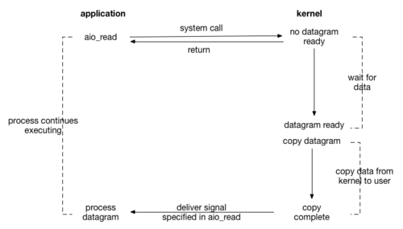

#### 网络IO模型

每次IO，都要经由两个阶段

- 第一步：将数据从磁盘文件先加载至内核内存空间（缓冲区），等待数据准备完成，时间相对较长

  wait for data

- 第二步：将数据从内核缓冲区复制数据到用户空间进程中，时间相对较短

  copy data from kernel to user

##### 两组概念 同步/异步 阻塞/非阻塞

- 同步/异步 ：关注的是消息通知机制
  - 同步：synchronous，调用者自己主动等待被调用者返回消息才能继续执行
  - 异步：asynchronous，被调用者通过状态、通知或回调机制主动通知调用者自身的运行状态
- 阻塞/非阻塞 ：关注的调用者在等待被调用者返回结果之前的状态
  - 阻塞：blocking，指用户发起IO请求后，在IO操作完成，返回结果之前一直处于被挂起状态
  - 非阻塞：nonblocking，指用户发起IO请求后，在IO完成，调用结果返回之前，不会被挂起

##### IO模型

阻塞型、非阻塞型、复用型、信号驱动型、异步

1. **同步阻塞IO** Blocking IO

   - 用户进程在内核进行IO操作时被阻塞
   - 用户进程通过系统调用向内核发起IO请求，由用户空间转到内核空间。内核等到数据包到达后，然后将数据从内核空间copy到用户空间，供用户处理
   - 用户在发起调用到数据copy完成，读取到数据之前一直被内阻塞，导致用户在发起IO请求时，不能做任何事情，对CPU的资源利用率不够

   

2. **同步非阻塞IO** Non-blocking IO

   - 用户进程在发起系统调用请求IO后可以立即返回，但并没有读取到任何数据，需要不断发起IO请求，直到数据到达后，才真正读取到数据，继续执行。
   - 在IO等待数据阶段不断进行轮训，直到数据准备好，再进行IO第二阶段，轮训消耗大量CPU资源

   

3. **IO多路复用** IO Multiplexing

   - IO多路复用是指内核一旦发现进程指定的一个或多个IO条件准备就绪，就通知该进程
   - 用户将需要进行IO操作添加到select中，然后可以执行其他工作（异步），同时等待select系统调用返回。当数据准备好后，select函数返回可执行结果，激活IO，用户进行IO数据copy阶段，继续执行
   - 整个IO阶段，数据等待阶段阻塞在select，用户阻塞在数据copy阶段，有两次阻塞
   - select可以添加多个IO操作，一个select可以对多个IO请求状态进行监视

   

4. **信号驱动IO** signal-driven I/O

   - 用户进程可以通过sigaction系统调用注册一个信号处理程序，然后主程序可以继续向下执行，当有IO操作准备就绪时，由内核通知触发一个SIGIO信号处理程序执行，然后将用户进程所需要的数据从内核空间copy到用户空间
   - 此模型的优势在于等待数据到达期间进程不被阻塞。用户程序可以继续执行，只要等待来自信号处理函数的通知

   

5. **异步IO** Asynchronous IO

   异步IO模型中，当用户线程收到通知时，数据已经被内核读取完毕，并放在了用户线程指定的缓冲区内，内核在IO完成后通知用户线程直接使用即可。

   


#### IO多路复用机制

**I/O多路复用（multiplexing）的本质是通过一种机制（系统内核缓冲I/O数据），让单个进程可以监视多个文件描述符，一旦某个描述符就绪（一般是读就绪或写就绪），能够通知程序进行相应的读写操作**

**1、select**

select()的机制中提供一种fd_set的数据结构，实际上是一个long类型的数组，每一个数组元素都能与一打开的文件句柄（不管是Socket句柄,还是其他文件或命名管道或设备句柄）建立联系，建立联系的工作由程序员完成，当调用select()时，由内核根据IO状态修改fd_set的内容，由此来通知执行了select()的进程哪一Socket或文件可读。

select的本质是采用32个整数的32位，即32\*32= 1024来标识，fd值为1-1024。当fd的值超过1024限制时，就必须修改FD_SETSIZE的大小。这个时候就可以标识32*max值范围的fd。

```c
int select(int maxfdp1,fd_set *readset,fd_set *writeset,fd_set *exceptset,const struct timeval *timeout);
【参数说明】
int maxfdp1 指定待测试的文件描述字个数，它的值是待测试的最大描述字加1。
fd_set *readset , fd_set *writeset , fd_set *exceptset
fd_set可以理解为一个集合，这个集合中存放的是文件描述符(file descriptor)，即文件句柄。中间的三个参数指定我们要让内核测试读、写和异常条件的文件描述符集合。如果对某一个的条件不感兴趣，就可以把它设为空指针。
const struct timeval *timeout timeout告知内核等待所指定文件描述符集合中的任何一个就绪可花多少时间。其timeval结构用于指定这段时间的秒数和微秒数。
【返回值】
int 若有就绪描述符返回其数目，若超时则为0，若出错则为-1
```

**2、poll**

poll与select不同，通过一个pollfd数组向内核传递需要关注的事件，故没有描述符个数的限制，pollfd中的events字段和revents分别用于标示关注的事件和发生的事件，故pollfd数组只需要被初始化一次。

```c
int poll(struct pollfd *fds, nfds_t nfds, int timeout);
typedef struct pollfd {
        int fd;                         // 需要被检测或选择的文件描述符
        short events;                   // 对文件描述符fd上感兴趣的事件
        short revents;                  // 文件描述符fd上当前实际发生的事件
} pollfd_t;
【参数说明】
struct pollfd *fds fds是一个struct pollfd类型的数组，用于存放需要检测其状态的socket描述符，并且调用poll函数之后fds数组不会被清空；一个pollfd结构体表示一个被监视的文件描述符，通过传递fds指示 poll() 监视多个文件描述符。其中，结构体的events域是监视该文件描述符的事件掩码，由用户来设置这个域，结构体的revents域是文件描述符的操作结果事件掩码，内核在调用返回时设置这个域
nfds_t nfds 记录数组fds中描述符的总数量
【返回值】
int 函数返回fds集合中就绪的读、写，或出错的描述符数量，返回0表示超时，返回-1表示出错；
```

**3、epoll**

epoll还是poll的一种优化，返回后不需要对所有的fd进行遍历，在内核中维持了fd的列表。select和poll是将这个内核列表维持在用户态，然后传递到内核中。与poll/select不同，epoll不再是一个单独的系统调用，而是由epoll_create/epoll_ctl/epoll_wait三个系统调用组成，后面将会看到这样做的好处。epoll在2.6以后的内核才支持。

```c
int epoll_create(int size);
int epoll_ctl(int epfd, int op, int fd, struct epoll_event *event);
int epoll_wait(int epfd, struct epoll_event * events, int maxevents, int timeout);
# 描述
int epoll_create(int size)：创建一个epoll的句柄，size表示监听数目的大小。创建完句柄它会自动占用一个fd值，使用完epoll一定要记得close，不然fd会被消耗完。
int epoll_ctl：这是epoll的事件注册函数，和select不同的是select在监听的时候会告诉内核监听什么样的事件，而epoll必须在epoll_ctl先注册要监听的事件类型。
它的第一个参数返回epoll_creat的执行结果
第二个参数表示动作，用下面几个宏表示
EPOLL_CTL_ADD：注册新的fd到epfd中；
EPOLL_CTL_MOD：修改已经注册的fd的监听事件；
EPOLL_CTL_DEL：从epfd中删除一个fd；
第三参数为监听的fd,第四个参数是告诉内核要监听什么事
int epoll_wait：等待事件的发生，类似于select的调用
```

epoll是Linux内核为处理大批量文件描述符而作了改进的poll，是Linux下多路复用IO接口select/poll的增强版本，它能显著提高程序在大量并发连接中只有少量活跃的情况下的系统CPU利用率。原因就是获取事件的时候，它无须遍历整个被侦听的描述符集，只要遍历那些被内核IO事件异步唤醒而加入Ready队列的描述符集合就行了。

**select/poll的几大缺点**：
1、每次调用select/poll，都需要把fd集合从用户态拷贝到内核态，这个开销在fd很多时会很大
2、同时每次调用select/poll都需要在内核遍历传递进来的所有fd，这个开销在fd很多时也很大
3、针对select支持的文件描述符数量太小了，默认是1024   cat /proc/sys/fs/file-max
4、select返回的是含有整个句柄的数组，应用程序需要遍历整个数组才能发现哪些句柄发生了事件；
5、select的触发方式是水平触发，应用程序如果没有完成对一个已经就绪的文件描述符进行IO操作，那么之后每次select调用还是会将这些文件描述符通知进程。
相比select模型，poll使用链表保存文件描述符，因此没有了监视文件数量的限制，但其他三个缺点依然存在。

**epoll优点:**
1、epoll 没有最大并发连接的限制，上限是最大可以打开文件的数目，这个数字一般远大于 2048, 一般来说这个数目和系统内存关系很大  ，具体数目可以 cat /proc/sys/fs/file-max 察看。
2、效率提升， Epoll 最大的优点就在于它只管你“活跃”的连接 ，而跟连接总数无关，因此在实际的网络环境中， Epoll 的效率就会远远高于 select 和 poll 。非轮训方式，不会随着FD数目的增加而效率下降
3、内存拷贝， Epoll 在这点上使用了“共享内存 ”，这个内存拷贝也省略了。利用MMAP(memory mapping)加速与内核空间的消息传递；

